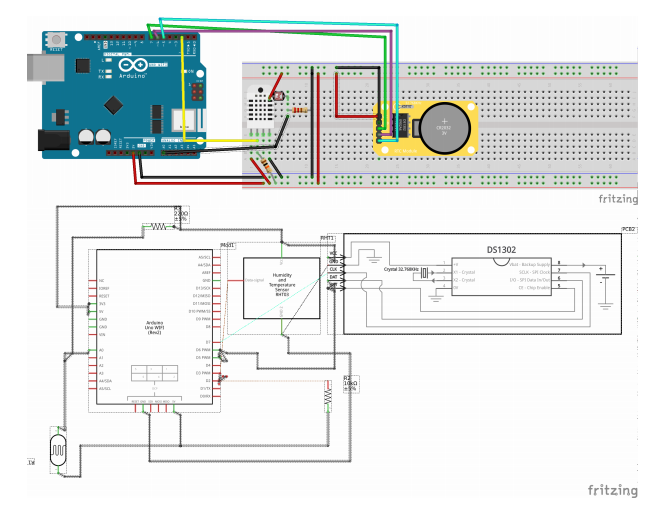

# Freezer Temperature Control


The aim of the project is to built an Arduino-based controller for the freezer temperature.
Arduino collects logs of temperature and humidity. The board also have a light sensor
in order to detect if the door of the fridge is open or closed. We assume the sensor is
in the feezer, so in a dark enviroment if the door is closed. All the data are sent with a
timestamp calculate with a RTC module. The data are sent through mqtt protocol to a
online mqtt broker, then the data are saved on Azure Cosmos DB, a noSql database.
An application was built in order to visualize the data.

## 2 Arduino hardware

The hardware part used is composed by:

- **Arduino UNO wifi Rev**
- **DHT22 sensor**
- **RTC clock module**
- **Photo resistor sensor**

The arduino board is connected to the DHT sensor for humidity and temperature. A
photo resistor is connected to detect the light in the freezer and to check if it is open or
not. Arduino reads the data from the sensors and sends a json string with a timestamp
throught mqtt to the CloudMqtt broker service. The json string is alike:


```
1 {
2 "humidity" : 63.5,
3 "temperature" : 19.3,
4 "lightSensor" : "10",
5 "year" : "2020"
6 "mounth" : "1",
7 "day" : "22",
8 "hours" : "3",
9 "minutes" : "21",
10 "seconds" : "1"
11 }
```

The schematics for Arduino is the following:



## 3 Cloud Infrastructure

The arduino board is connected to CloudMqtt broker services,through mqtt. The mes-
sage are sent every 2 seconds. The message are sent with low QoS and without any
particular security features because losing some data it’s not a relevant problem for the
project.
The messages are collected with a small azure virtual machine instance and write on
cosmos DB database. A noSQL database was chosen because there’s no need for
relation in the DB, but the data are just saved from json.

### 3.1 MQTT

Mqtt is a lightweight, push-subscribe network protocol that transports messages be-
tween devices. The protocol is the first choice to exchange messages between devices
because:

- Light enough to run on an embedded device with limited processor or memory
    resources
- Can work with low and unreliable bandwidht

The message can be sent with 3 different QoS.

- At most once (QoS 0)
    the message is sent only once and the client and broker take no additional
steps to acknowledge delivery (fire and forget)
- At least once (QoS 1)
    the message is re-tried by the sender multiple times until acknowledgement
is received (acknowledged delivery)
- Exactly once (QoS 2)
    the sender and receiver engage in a two-level handshake to ensure only one
copy of the message is received (assured delivery)

In the project a QoS 0 is used because the messages are sent continuously, so a mes-
sage lost is irrelevant for the project. CloudMqtt is the online broken choose because
the azure broker don’t follow the complete mqtt standard and the ArduinoMqtt library
have a low support for the ssl connection required from the Azure IoT hub. The data
so are sent to CloudMqtt topic called: /devices/tempcontrol.


### 3.2 Azure Virtual Machine

The messages sent to the broker are consumed by an Azure Virtual Machine wich is
subscribed to the /devices/tempcontrol topic. The performance required is very low,
so the virtual machine is the cheapest available, with 1 core and 512MiB of RAM. A
nodeJS script is used for the mqtt connection to CloudMqtt provider and the data are
clean for an easy usage. The data are saved as json for convenience, alike:

#### 1 {

```
2 "humidity" : 64.2,
3 "temperature" : 19.2,
4 "doorStatus" : "close",
5 "date" : "2020-01-12T23:41:08Z"
6 }
```
The nodeJS script manages also the connection to CosmosDB for data persistence.
If the freezer door is open an email is sent to inform of that.

### 3.3 Cosmos DB

The persistence are managed by the Azure noSQL database Cosmos DB. A noSQL
database was choosen because the data are collected as a datawarehouse, so there’s
no relation between data. The main advantage of a noSQL is the scalability and per-
formance, which are astonishingly fast compare to a sql database. The data are saved
with a mandatory autogenerated id on the database in a form as the following:

#### 1 {

```
2 "_id" : ObjectId("5e1ba13907194748c74120c7"),
3 "humidity" : 64.2,
4 "temperature" : 19.2,
5 "doorStatus" : "close",
6 "date" : "2020-01-12T23:41:08Z"
7 }
```
## 4 Client Application

The data are visualized by a client application developed with flutter framework. Flutter
is a Google framework which aim to develop multi platform application (Android, Ios and
web) with a single codebase. The main language of flutter is dart, then the application
is transpiled for all the supported platform.


### 4.1 Flutter Client Application

The application is currently tested on Android devices. The application is divided in two
tabs, one for the humidity data and one for the temperature data:

The history of the data is shown in a chart, then we could see the average and the
last measurement. The door status is visible in both the tabs. The data are updated in
real time with Cosmos DB server.

### 4.2 IFTTT

IFTTT is a online service to create chains of simple conditional statements, called
applets. The server application sent to a IFTTT webhooks a signal if the freezer door
is open, then an email with the data is sent to inform the user
